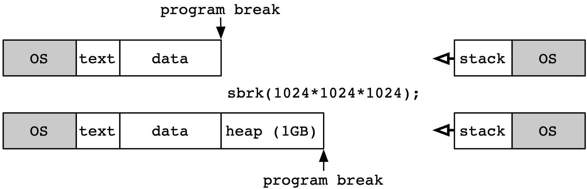
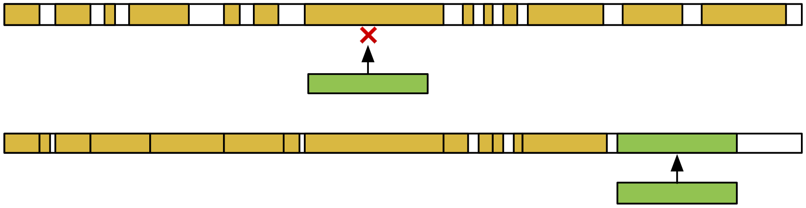
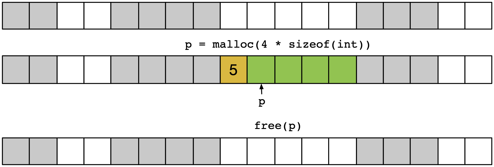
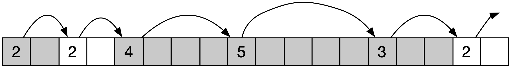
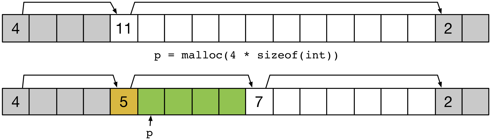
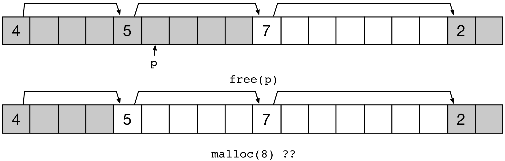
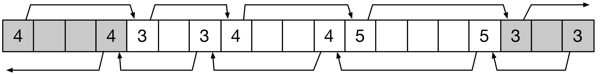
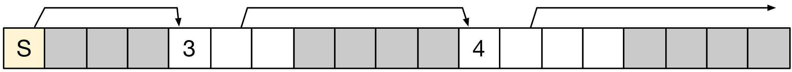
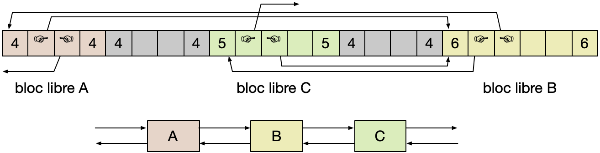
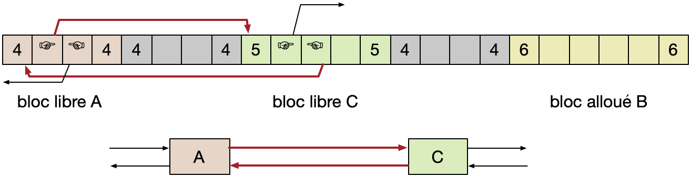

.. -*- coding: utf-8 -*-
.. Copyright |copy| 2012, 2020 by `Olivier Bonaventure <http://inl.info.ucl.ac.be/obo>`_, Etienne Rivière, Christoph Paasch et Grégory Detal
.. Ce fichier est distribué sous une licence `creative commons <http://creativecommons.org/licenses/by-sa/3.0/>`_

.. _declarations:

Gestion de la mémoire dynamique
===============================

Nous avons vu dans la section précédente comment allouer et libérer de la mémoire dans le :term:`heap` (tas) en utilisant les fonctions de la librairie standard `malloc(3)`_ et `free(3)`_, ainsi que leurs dérivées.

Pour rappel, les signatures de ces deux fonctions sont les suivantes :

.. code-block:: c

   void *malloc(size_t size);
   void free(void *ptr);

`malloc(3)`_ renvoie un pointeur vers une zone de mémoire du :term:`heap` de taille *minimum* ``size`` octets.
`free(3)`_ permet de libérer une zone mémoire précédemment réservée indiquée par le pointeur ``ptr``.
Cette dernière fonction a un comportement indéterminé si elle est appelée avec un pointeur ne correspondant pas à une zone mémoire réservée et non encore libérée.

La gestion du :term:`heap` est sous la responsabilité d'un algorithme de *gestion de mémoire dynamique*.
L'objectif de cet algorithme est double. 
Premièrement, il doit retourner des zones réservées qui ne se chevauchent pas entre elles, et contiennent *au moins* le nombre d'octets demandés. 
Deuxièmement, il doit permettre de *recycler* la mémoire des zones libérées pour pouvoir les utiliser de nouveau pour héberger de nouvelles zones réservées.

Dans cette section, nous étudierons les principes et la mise en œuvre des algorithmes de gestion de mémoire dynamique.

Nous ne couvrirons pas la mise en œuvre de l'appel `realloc(3)`_ dans le cadre de ce cours.
L'appel `calloc(3)`_ peut être mis en œuvre en utilisant `malloc(3)`_, ce qui est laissé en exercice.

Gestion du heap 
---------------

L'adresse de départ du :term:`heap` est toujours l'octet qui suit le segment des données non-initialisées.
Son adresse de fin est appelée le *program break* sous Linux.
Au démarrage d'un programme sous Linux, l'adresse de départ et l'adresse de fin sont identiques.
La taille du :term:`heap` initiale est donc de 0.

Traditionnellement sous UNIX, deux appels système permettent de changer la valeur du *program break* et donc d'augmenter la taille du :term:`heap`.
Ces deux appels sont définis dans ``<unistd.h>`` :

.. code-block:: c

   #include <unistd.h>
   int brk(void *addr);
   void *sbrk(intptr_t increment);

L'appel `brk(2)`_ permet de fixer le *program break* a une valeur arbitraire.
Sa valeur de retour est 0 lorsque l'opération est un succès, -1 sinon.
L'appel `sbrk(2)`_ permet d'incrémenter la valeur du *program break* d'un nombre d'octets fourni en argument, et retourne la nouvelle valeur  du *program break*.
Appeler `sbrk(2)`_ avec un argument de 0 permet de lire la valeur actuelle du *program break* sans la modifier.
La figure suivante illustre le fonctionnement de l'appel `sbrk(2)`_ pour réserver 1 Giga-octet de mémoire pour le :term:`heap`.

Les deux appels `brk(2)`_ et `sbrk(2)`_ peuvent échouer, en particulier lorsque la valeur demandée pour le *program break* résulte en un dépassement de la taille maximale autorisée pour le programme appelant.
Cette taille maximale dépend des paramètres du système et des autorisations de l'utilisateur.
On peut connaître ces dernières en utilisant l'utilitaire `ulimit(1posix)`_.

En pratique, un programme utilisateur utilise très rarement les appels `brk(2)`_ et `sbrk(2)`_ mais fait appel aux fonction de l'algorithme de gestion de mémoire dynamique, c'est à dire `malloc(3)`_ et `free(3)`_.
La mise en oeuvre de  `malloc(3)`_ détermine ainsi quand il est nécessaire d'utiliser `sbrk(2)`_ pour étendre la taille de la :term:`heap` afin de répondre à une demande d'allocation, et la mise en oeuvre de `free(3)`_ peut de façon similaire décider de réduire la taille du :term:`heap` en appelant `sbrk(2)`_ avec un argument négatif.

Note : On notera que des alternatives à `sbrk(2)`_ existent pour réserver de la mémoire dynamiquement pour le :term:`heap` d'un programme, et en particulier l'appel système `mmap(2)`_ que nous couvrirons lorsque nous aborderons la mise en œuvre de la mémoire virtuelle. 
C'est la méthode qui est désormais utilisée par Linux, même si `sbrk(2)`_ reste supporté pour assurer la compatibilité.
Les principes de mise en œuvre de la gestion de la mémoire dynamique présentés ci-dessous sont d'application dans les deux cas.

Contraintes
-----------

Un algorithme de gestion de mémoire dynamique obéit aux besoins et contraintes suivants :

- Il est nécessaire de conserver de l'information (des méta-données) sur les blocs alloués et libérés;
- Le segment :term:`heap` doit être utilisé pour stocker ces méta-données. Les autres segments de la mémoire sont en effet dédiés aux données du programme lui-même (segments *text*, segments de données initialisées et non initialisées, etc.). Il n'est donc possible de stocker les méta-données utilisées par l'algorithme que dans le segment :term:`heap` lui même. Les méta-données doivent donc être *intercalées* avec les zones de mémoire allouées par l'application.

Par ailleurs, il est généralement nécessaire que les zones mémoires allouées soient *alignées*. Cela veut dire que l'adresse de début de chaque zone, ainsi que la taille de la zone, doivent être des multiples d'un *facteur d'alignement* propre au système. 
Ce facteur est de 8 octets sous Linux.
Une zone réservée sera toujours d'une taille multiple du facteur d'alignement.
Par exemple, sous Linux, une demande pour 17 octets réservera en réalité 24 octets, le multiple de 8 supérieur le plus proche.
On appelle cette extension de la zone demandé le *padding*.

L'alignement permet tout d'abord de faire des hypothèses sur les adresses retournées (les bits de poids faibles sont toujours à 0 : avec un facteur d'alignement de 8 les trois derniers bits des adresses retournées par `malloc(3)`_ valent ainsi toujours 0).
L'alignement facilite aussi comme nous allons le voir la mise en oeuvre et l'efficacité des algorithmes de gestion de mémoire dynamique.
L'exemple ci-dessous illustre l'alignement utilisé par `malloc(3)`_ sous Linux.

.. literalinclude:: /C/src/malloc_align.c
   :encoding: utf-8
   :language: c
   :start-after: ///AAA
   :end-before: ///BBB

L'exécution de ce programme produit la sortie standard suivante.

.. literalinclude:: /C/src/malloc_align.out
   :encoding: utf-8
   :language: console

On peut observer que la zone réservée pour  ``b`` est située 16 octets plus loin que celle pour ``a`` même si cette dernière ne demandait qu'une zone de 1 octet.
Il est intéressant d'analyser ce résultat.
On observe tout d'abord que, bien qu'elle soit une multiple de 8, le facteur d'alignement, l'adresse ``0x8e29010`` n'ait pas été retournée pour ``b``, ce qui aurait pourtant laissé un espace de 8 octets pour ``a``.
La raison est que la zone nécessaire pour ``a`` ne contient pas seulement les octets retournés mais aussi des métadonnées nécessaires à l'algorithme de gestion de la mémoire dynamique.
La zone réservée pour ``c`` est elle encore 16 octets plus loin que celle pour ``b``, son adresse de démarrage est ainsi alignée sur le facteur d'alignement de 8.

Objectifs
---------

On mesure la qualité d'un algorithme de gestion de mémoire dynamique selon **trois critères** principaux.

**Premièrement**, les appels aux fonctions `malloc(3)`_ et `free(3)`_ doivent idéalement s'exécuter le plus rapidement possible, et ce temps d'exécution doit varier le moins possible entre plusieurs appels. Ces fonctions sont effectivement utilisées de manière intensive par de nombreux programmes, et les appels à `malloc(3)`_ et `free(3)`_ peuvent se trouver dans des chemins de code critiques dont la performance ne doit pas varier au cours du temps ou ne doit pas varier en fonction de la quantité de données manipulées par le programme.

**Deuxièmement**, l'algorithme doit utiliser la mémoire disponible de manière *efficace*. Il doit pour cela réduire la *fragmentation*. On distingue la fragmentation externe et la fragmentation interne :

- La fragmentation externe mesure à quel point l'espace mémoire complet est fragmenté avec de nombreuses zones libres intercalées entre des zones réservées. On peut voir un exemple de deux heaps dans l'illustration ci-dessous. Les espaces alloués sont représentés en jaune. Dans la heap du haut, on observe que l'espace disponible est fragmenté en de nombreux *trous* entre les espaces alloués. Une requête d'allocation, représentée en vert, ne peut pas être servie car il n'existe pas de trou de taille suffisante pour la placer. Il est donc nécessaire, dans ce cas, d'augmenter la taille du :term:`heap`. En revanche, dans la heap du dessous, l'espace disponible est réparti en de moins nombreux trous et il est possible de répondre à la demande d'allocation directement.

- La fragmentation interne mesure l'espace *perdu* pour chaque allocation, qui n'est pas utilisé pour stocker des donnés. Cela inclut l'espace de *padding*, mais aussi l'espace utilisé pour stocker les métadonnées. Dans l'exemple plus haut, l'espace nécessaire pour la zone ``a`` de 1 octet demandé fait 16 octets, ce qui résulte en une fragmentation interne de 15 octets.

.. note:: La défragmentation n'est pas une option

 On pourrait être tenté de chercher un mécanisme pour revisiter l'allocation des zones allouées dans le but de réduire la fragmentation, par exemple en décalant les blocs pour éliminer zones vides.
 Cela n'est malheureusement pas possible dans ce contexte : les pointeurs vers les zones allouées ont déjà été retournés à l'application par `malloc(3)`_ et il n'est plus possible de les changer.
 Il faut donc prendre en compte l'objectif de réduction de la fragmentation dès le départ, lors des appels à `malloc(3)`_ et `free(3)`_.

**Troisièmement**, les espaces mémoires réservés par des appels `malloc(3)`_ successifs doivent être idéalement proches les uns des autres. Cette propriété de *localité* est importante pour maximiser l'utilisation du cache du processeur, dont l'utilité dépend de cette notion de localité. 
De façon générale, il est recommandé de suivre le principe : les données allouées de façon proche dans le temps doivent être proches en mémoire, et les données similaires (de même taille) doivent aussi être proches en mémoire car dans les deux cas il y a une probabilité importante qu'elles soient accédées ensemble.
Les principes (simplifiés) du fonctionnement d'un cache sont détaillés ci-dessous pour en comprendre les raisons.

.. note:: Le principe de localité et le cache du processeur

 Pour comprendre le principe de localité il nous faut comprendre le principe de cache.
 Dans notre modèle de système informatique présenté précédemment, nous avons considéré que le processeur effectuait des opérations de lecture et d'écriture directement vers la mémoire principale.
 L'évolution de la technologie a été telle que désormais la vitesse d'exécution d'un processeur est très largement supérieure à la vitesse à laquelle ou peut accéder à la mémoire : un processeur peut ainsi attendre des centaines de cycles avant de recevoir le résultat d'une opération de lecture en mémoire.
 Pour pallier ce problème, les processeurs sont équipés de *mémoire cache*.
 Cette mémoire est plus performante que la mémoire principale : sa latence d'accès est plus faible. 
 Elle est aussi beaucoup plus chère.
 La mémoire cache ne contient donc qu'un petit sous-ensemble des données utilisées par le programme, sous forme de lignes de cache dont la taille est généralement de quelques douzaines d'octets (par exemple, 64 octets).
 La mémoire principale n'est utilisée que si l'adresse lue n'est pas déjà présente dans le cache.
 En pratique, une grande partie des accès à la mémoire est servie par le cache grâce à la localité des accès : localité temporelle (une même donnée est lue plusieurs fois dans un intervalle de temps court) et la localité spatiale (si une donnée est lue alors il y a une forte probabilité que la donnée présente dans les octets suivants le soit aussi -- par exemple lors du parcours d'une structure de données).
 
 .. Afin de favoriser la localité et donc l'utilité de la mémoire cache, il est préférable que des appels à `malloc(3)`_ successifs renvoient des zones mémoires qui se jouxtent, et qui auront ainsi plus de chance d'être placées dans la même ligne de cache.

Enfin, il est préférable qu'un algorithme de gestion de la mémoire dynamique soit robuste et qu'il facilite le déboguage.
Par exemple, il est préférable que l'on puisse vérifier, lors d'un appel à `free(3)`_ que l'adresse soit vérifiable comme étant effectivement une adresse précédemment retournée par un appel à `malloc(3)`_.

Algorithmes
-----------

Il existe de très nombreux algorithmes de gestion de la mémoire dynamique, dont certains sont très sophistiqués.
L'objectif de ce cours n'est pas de les présenter de façon exhaustive mais d'illustrer le compromis entre performance, localité, et efficacité de l'utilisation de la mémoire avec des exemples simples.
Ce sujet permet par ailleurs de montrer un exemple concret de la séparation entre mécanisme et politique, typique de la philosophie des systèmes UNIX.

Dans les descriptions ci-dessous, on considèrera que la mémoire est divisée en cases pouvant contenir chacune un mot long, c'est à dire soit un entier soit une adresse.
Un *bloc* est composé de plusieurs mots contigus.
Pour chaque bloc, il est nécessaire de conserver des méta-données de deux types : la longueur de ce bloc, et un *drapeau* indiquant s'il s'agit d'un bloc réservé ou d'un bloc libre.
Une méthode simple pour stocker les méta-données est de réserver un mot dédié sité avant le bloc de données proprement dit, comme l'illustre la figure ci-dessous.
Dans cet exemple, le mot de méta-données (*header* en anglais), en jaune, augmente donc de une case l'espace nécessaire pour héberger la zone demandée de 4 blocs, en vert, donc l'adresse retournée sera ``p``.
Ici la taille du bloc stockée dans le header sera de 5 mots (on indique 5 ici, mais c'est bien ``5*sizeof(int*)`` qui est stocké), et le bloc sera marquée comme réservée.

.. note:: Utilisation du bit de poids faible pour stocker l'état d'un bloc

 On note que si la taille des blocs en octets est toujours un multiple de 2 (ce qui est le cas dans notre exemple ou chaque mot fait 8 octets ou 64 bits), alors on a l'assurance que le bit de poids faible sera de valeur 0.
 On peut tirer partie de cela pour stocker le drapeau indiquant s'il s'agit d'un bloc libre ou d'un bloc réservé : le bit de poids faible peut être positionné à 0 pour indiquer un bloc libre, et positionné à 1 pour indiquer un bloc réservé.
 On peut alors utiliser les opérations de manipulations de bit pour forcer à 1 ou 0 la valeur de ce bit, et un masque binaire pour lire sa valeur.
 Ainsi, si ``c`` est la valeur du compteur stockée dans le bloc on peut obtenir son état en utilisant ``c & 0x1``, forcer sa valeur à 1 en utilisant ``c = c | 0x1;`` ou enfin forcer sa valeur à 0 avec ``c = c & ~0x1;``.
 Attention toutefois, si on souhaite utiliser la valeur du compteur, il faut penser à masquer la valeur du bit de poids faible en lisant ``c & ~0x1``. 

Utilisation d'une liste implicite
^^^^^^^^^^^^^^^^^^^^^^^^^^^^^^^^^

L'algorithme le plus simple utilisant le principe de header dédiés utilise une liste implicite.
Cet algorithme peut trouver un bloc libre d'une taille demandé, s'il existe, en suivant un à un les cases de header.
Il parcoure ainsi l'ensemble des blocs réservés et libres, comme illustré par la figure ci-dessous.

Le parcours de cette liste peut ressembler alors au pseudo-code suivant, où ``p`` est un pointeur vers une case mémoire et ``start`` le début du heap :

.. code-block:: c

   p = start; 
   while (p < end &&           // fin de liste ?
          ((*p & 0x1) != 0 ||  // déjà alloué
           *p <= len))         // trou trop petit
       p = p + (*p & ~0x1);    // progresse vers le prochain bloc

On notera ici l'utilisation conjointe d'opérateurs binaires (``&``)  pour accéder à la valeur du bit de poids faible du header, et des opérateurs logiques (``&&`` et ``||``).
Il ne faut pas les confondre !

Le parcours de la liste va trouver, s'il existe, un espace assez grand pour accueillir la zone dont la création est demandée.
Cette zone peut être trop grande et doit alors être scindé en une zone réservée et une nouvelle zone libre, comme illustré par la figure ci-dessous.

La fonction de placement d'un nouveau bloc de taille ``len`` au pointeur pointé par ``p`` retourné précédemment peut ressembler au pseudo-code suivant :

.. code-block:: c

   void place_block(ptr p, int len) {
     int newsize = len + 1;                // ajoute 1 mot pour le header
     int oldsize = *p & ~0x1;              // récupère taille actuelle sans bit de poids faible
     *p = newsize | 0x1;                   // nouvelle taille avec bit de poids faible à 1
     if (newsize < oldsize)                // s'il reste de la place ...
       *(p + newsize) = oldsize - newsize; // nouveau bloc vide avec la taille restante
   }

L'exécution de ce code est assez simple.
Il faut simplement faire attention ici à ne pas laisser le bit de poids fort pour le header du nouveau bloc.
Bien entendu, l'adresse qui est retournée au code client n'est pas ``p`` mais ``p-1`` : le header n'a pas a être visible par l'application qui n'a accès qu'au bloc de données proprement dit.

La manière la plus simple de libérer un bloc avec une liste implicite consiste à passer le drapeau, stocké dans le bit de poids faible du header, à 0.
Ainsi, un appel à ``free(p)`` peut simplement exécuter ``*(p-1)= *(p-1) & ~0x1;``.
Cette méthode naïve présente deux désavantages majeurs :

- Tout d'abord, elle ne vérifie pas que le pointeur passé à free() est un pointeur valide. Il est possible de simplement modifier un bit dans un mot utilisé pour stocker des données, ce qui peut entraîner des bogues particulièrement difficile à découvrir. Il est préférable de stopper l'exécution du programme si free() est appelé pour une adresse invalide. Pour cela toutefois, il est nécessaire de parcourir de nouveau la liste depuis le début pour savoir si l'adresse du header ``p-1`` est bien valide. Le coût de free() devient donc O(n) où est le nombre de blocs, et plus O(1).

- Ensuite, cette méthode entraîne un problème de *fausse fragmentation*. On peut ainsi plusieurs blocs libres les uns à la suite des autres, mais aucun de ces blocs n'est suffisant pour accueillir une demande d'allocation. Cette situation est illustrée par la figure suivante. Une requête ``malloc(8)`` arrive, et bien qu'il existe deux blocs de tailles 5 et 7 contiguës, il n'y a pas de bloc de taille 9 disponible.

Il y a deux manières de répondre au problème de la fausse fragmentation.
Une première serait de laisser les blocs contigus tels quels, et de modifier la fonction de recherche de bloc pour qu'elle prenne en compte leur existence lors de la recherche d'un bloc libre.
Cette approche est dite paresseuse (lazy en anglais) car elle procrastine le travail jusqu'au dernier moment.
Elle a ses avantages, mais elle complique la mise en œuvre de la fonction `malloc(3)`_.
Nous laissons son développement en exercice au lecteur.

Une seconde approche est de regrouper les zones libres lors du traitement du `free(3)`_.
Dans l'exemple de la figure précédente, il est possible de regrouper les deux blocs libres pour en former un seul.

Le pseudo-code de la fonction free_block, prenant en argument l'adresse du *header* à libérer, peut être :

.. code-block:: c

   void free_block(ptr p) {
     *p = *p & ~0x1;          // remise à 0 du drapeau
     next = p + *p;           // calcul de l'adresse du header du bloc suivant
     if ((*next & 0x1) == 0)  // si ce bloc est aussi libre ...
       *p = *p + *next;       // combiner les blocs
   }

On remarque toutefois que cette méthode est incomplète.
En effet, elle permet de fusionner un bloc libre avec les blocs qui le suive, mais pas avec les blocs qui le précèdent.
Ce problème est caractéristique d'une liste chaînée simple : on ne sait simplement pas revenir en arrière.
Il y a deux solutions possibles à ce problème.
Une première solution est de garder un *historique* des adresses des derniers headers vus lors du parcours (par exemple sur la pile), et de re-parcourir les blocs libres jusqu'à atteindre celui sélectionné, puis ses successeurs.
Cette solution impose un surcoût en mémoire lors de l'exécution de `free(3)`_ mais ne nécessite pas de modifier 
Une deuxième méthode, plus simple à mettre en œuvre mais entrainant un surcoût d'utilisation mémoire, est d'utiliser un liste chaînée bi-directionnelle.
Cette méthode est illustrée ci-dessous.
Elle consiste simplement à répliquer le header avant et après le bloc de données (nécessitant ainsi 2 mots supplémentaires et plus un seul), ce qui permet le parcours, et donc la fusion des blocs libres dans les deux sens.
Par exemple ici, la réservation du troisième bloc libre entraînera la fusion avec les deux blocs libres précédents.
La figure suivante illustre ce principe.

Politique de placement
^^^^^^^^^^^^^^^^^^^^^^

L'algorithme de sélection du bloc libre à utiliser présenté et utilisé jusqu'ici est assez basique.
L'opération de recherche s'arrête dès qu'un bloc vide de taille *suffisante* pour héberger la nouvelle allocation est trouvée. 
On appelle cette politique de placement *first fit*.
Celle-ci peut prendre un temps linéaire en le nombre de blocs (alloués et libres) mais termine dès qu'un bloc valide est trouvé, et donc assez rapidement en pratique.
Toutefois, elle présente des désavantages en pratique, car elle entraîne de la fragmentation est n'a pas de bonnes propriétés de localité.
En effet, les allocations de petits objets ont tendance à s'accumuler au début de la zone mémoire, et lorsque ceux-ci sont libérés il subsiste de nombreux petits blocs libres qui ralentissent les recherches ultérieures.
Les allocations d'objets de taille plus importante, et en particulier les allocations successives, ne sont pas nécessairement placées dans des zones proches, ce qui entraîne une faible localité.

Il existe d'autres politiques, comme par exemple :

- La politique *next fit* se comporte de la même manière que *first fit* mais démarre la recherche depuis le dernier bloc alloué. Bien entendu, si aucun bloc de taille suffisante n'est trouvé, il est nécessaire de recommencer depuis le début du heap. Cette politique a de meilleures propriétés de localité que *first fit* mais les évaluations montrent qu'elle conduit à une encore plus grande fragmentation.

- La politique *best fit* cherche a répondre à une demande d'allocation avec un bloc donc la taille est la plus proche de celle demandée (juste nécessaire). Cette politique a l'avantage d'être optimale en terme de fragmentation. Toutefois, elle a deux désavantages : elle a potentiellement une mauvaise localité, les blocs libres de taille équivalente n'étant pas nécessairement proches les uns des autres, et elle nécessite un parcours complet de la liste dans tous les cas (sauf, bien sûr, si un bloc de la taille exactement demandée est trouvé).

Ces politiques représentent des compromis différents entre les critères que nous avons défini plus haut : rapidité d'exécution, fragmentation de la mémoire, et localité.

Utilisation d'une liste explicite
^^^^^^^^^^^^^^^^^^^^^^^^^^^^^^^^^

Nous allons maintenant étudier une autre alternative, qui consiste à créer une liste explicite liant *uniquement* les blocs libres entre eux.
Le principe est ici d'utiliser l'espace disponible dans chaque blocs libre pour y stocker des pointeurs vers un prochain bloc libre.
Le parcours de la liste chaînée permet donc de ne considérer que les blocs libres, ce qui est plus rapide en particulier lorsque de nombreux blocs sont déjà alloués.
La figure suivante présente le principe avec une liste explicite *simplement* chaînée.

On notera l'utilisation du premier mot pour stocker un pointeur vers un premier bloc libre.
Pour chaque bloc libre, deux mots sont utilisés.
Le premier mot contient comme auparavant la taille du bloc libre.
Le deuxième mot contient un pointeur vers le prochain bloc libre.
Le parcours de la liste des blocs libres se fait en suivant ces pointeurs.

En pratique, une liste explicite est toujours une liste *doublement chaînée*, c'est à dire que chaque bloc libre contient un pointeur vers le prochain bloc dans la liste ainsi qu'un pointeur vers le bloc précédent.
Par ailleurs, l'ordre des blocs libres dans la liste explicite ne suit pas forcément l'ordre des adresses de début de ces blocs.
Une telle liste est illustrée par la figure suivante, qui présente seulement une partie du segment heap.

Les blocs libres A, B et C ne sont pas liés dans cet exemple dans l'ordre de leurs adresses.
Il est donc nécessaire de dupliquer le header de bloc vide au début et à la fin de chaque bloc comme expliqué précédemment, afin de permettre la fusion de blocs vides contigus dans les deux sens.
L'espace mémoire utilisée (fragmentation interne) est le même que dans le cas d'une liste implicite avec la duplication du header : deux mots supplémentaires sont nécessaires au début et à la fin de chaque bloc alloué.
En revanche, quatre mots sont nécessaires pour chaque bloc libre.
Ils servent à stocker les pointeurs vers le bloc successeur et prédécesseur de chaque bloc libre.
Cela n'a pas d'impact sur la fragmentation interne, puisque ces méta-données sont stockées dans les blocs libres.
En revanche, la taille minimum de bloc (libre ou alloué) est désormais de 4 mots.
Il est donc nécessaire, dans cet exemple, d'aligner les allocations de blocs pour qu'ils utilisent un multiple de 4 mots, en utilisant du *padding* si nécessaire.

L'allocation d'un bloc de données avec une liste explicite suit le même principe qu'avec une liste implicite, et peut obéir à des politiques similaires.
Il est nécessaire, bien entendu, de maintenir les propriétés de la liste doublement chaînée.
Ceci nécessite de mettre à jour le pointeur vers le bloc successeur du bloc libre précédent le bloc alloué, et le pointeur vers le bloc prédécesseur du bloc libre suivant le bloc alloué.
Ces opérations sont illustrés sur notre exemple dans la figure suivante, où les pointeurs en rouge représentent les pointeurs modifiés.

La libération d'un bloc est plus complexe qu'avec une liste implicite.
Cela est du au fait que la liste des blocs libres ne représente pas nécessairement l'ordre des adresses de ces blocs en mémoire.
Deux politiques sont possibles pour pallier cette difficulté :

- Une première politique, appelée *address-ordered* consiste à s'assurer que cette propriété d'ordre est assurée. Lors de la libération d'un bloc, celui-ci est inséré dans la liste chaînée exactement entre les deux blocs libres le précédent et le succédant dans l'ordre des adresses. Cette politique permet de fusionner très facilement les zones libres contigus (elles sont soit deux, soit trois, jamais plus). En revanche, elle a un défaut majeur : elle nécessite de parcourir la liste pour chercher l'endroit dans la liste où insérer le bloc vide.

- Une deuxième politique est de simplement insérer le bloc vide au début de la liste des blocs vides (on parle alors de politique LIFO, pour *Last-In-First-Out*). Cette approche a l'avantage indéniable que l'opération de libération est en temps constant. Toutefois, la fusion de zones libres contigus devient plus complexes et nécessite d'opérer des changements dans au plus trois éléments de la liste chaînée et leurs voisins respectifs. Nous n'en couvrirons pas les détails dans le cadre de ce cours.

En règle générale, la politique *address-ordered* entraîne une fragmentation externe moins importante que la politique LIFO.
Son principal désavantage réside donc dans son temps d'exécution, qui peut devenir important lorsque de nombreux blocs vides sont présents.

Utilisation de listes multiples
^^^^^^^^^^^^^^^^^^^^^^^^^^^^^^^

Les mécanismes et politiques de gestion de la mémoire dynamique qui ont été présentées ne font pas de distinction entre les demandes d'allocation de blocs de petite et de grande tailles.
Cela pose un inconvénient double.
Tout d'abord, le temps de recherche d'un bloc vide augmente linéairement avec le nombre de blocs (total pour une liste implicite, ou seulement libres pour une liste explicite).
Par ailleurs, le temps de recherche d'un bloc vide de grande taille peut prendre un temps plus important que la recherche d'un bloc vide de petite taille.

Une solution à ces défauts est d'utiliser non pas une, mais plusieurs listes.
Chaque liste correspond alors à une classe de taille.
Il peut ainsi y avoir une liste pour les blocs de taille 1, 2, 3, ou 4 octets, puis des listes pour les tailles correspondant aux puissances de 2 : 8, 16, 32, 64, etc. octets.
La recherche d'une zone libre est faite dans la liste correspondant à la taille immédiatement supérieure à la taille demandée : une demande d'allocation pour un bloc de taille 67 octets sera ainsi servi en utilisant la liste des blocs libres de taille 128, c'est à dire parmi les blocs libres de 65 à 128 octets.

On notera que l'utilisation de listes multiples a une synergie avec l'utilisation de listes explicites.
Il suffit, en effet, d'utiliser autant de pointeurs de début de liste que de listes, et de parcourir la liste adéquate.
Les opérations de réservation et de libération de blocs peuvent entraîner, en revanche, des opérations de recherche sur *plusieurs* listes.
Cela rend alors la politique *address-ordered* significativement plus coûteuse que la politique LIFO, qui peut alors être préférée dans ce cas.
