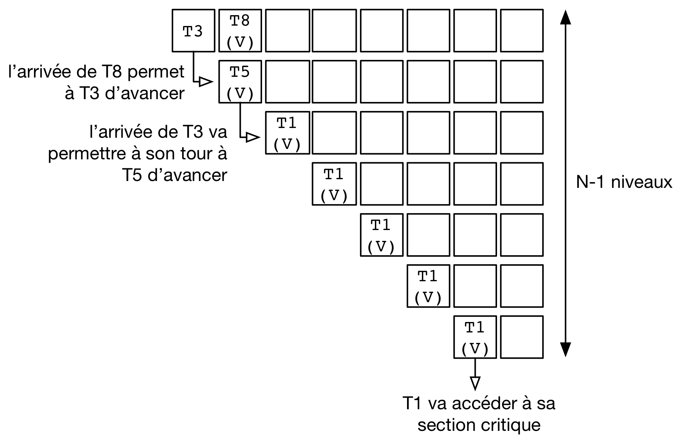

.. -*- coding: utf-8 -*-
.. Copyright |copy| 2012, 2020 by `Olivier Bonaventure <http://perso.uclouvain.be/olivier.bonaventure>`_, Etienne Rivière, Christoph Paasch, Grégory Detal
.. Ce fichier est distribué sous une licence `creative commons <http://creativecommons.org/licenses/by-sa/3.0/>`_

.. _declarations:

Mise en oeuvre de la synchronisation
====================================

Nous avons vu dans les chapitres précédents comment utiliser les constructions de synchronisation que sont les mutex et les sémaphores, fournies par les librairies POSIX.
Nous allons nous intéresser dans ce chapitre à comment ces constructions sont implémentées.

Nous mettrons l'emphase plus particulièrement sur la résolution du problème de l'exclusion mutuelle, utile pour protéger l'accès aux structures de données utilisées pour la synchronisation (e.g. protéger l'accès à l'état d'un mutex ou le compteur associé à un sémaphore).
Les mécanismes que nous verrons permettent de façon générale de protéger l'accès à des sections de code devant s'exécuter de manière exclusive les unes des autres.

.. La mise en attente des threads en état Blocked par le scheduler, lorsque ceux-ci
..
.. La mise en œuvre des mutex et des sémaphores requiert de résoudre deux problèmes :
..
.. - Premièrement il faut résoudre le problème de l'exclusion mutuelle pour que les accès aux données de synchronisation, comme la valeur entière du sémaphore,
..
.. Le problème de l'exclusion mutuelle car il permet de mettre en œuvre les opérations de plus haut niveau comme les séma
..
.. contenu
.. - introduction sur exclusion mutuelle et mise en oeuvre
.. - algorithmes classiques : Peterson, Filter, Bakery
.. - discussion sur défauts et difficultés d'implémentation
.. - opérations atomiques : principe haut niveau
.. - fonctionnement des caches et principe MESI :
..
..
.. Cette nouvelle section décrira la mise en œuvre des verrous (mutex) au sein d'un système d'exploitation. Elle couvrira les algorithmes classiques fondés sur des registres en lecture/écriture ainsi que des solutions plus efficaces utilisant les opérations atomiques.
..
.. possible sources:
.. - https://www.cs.virginia.edu/~cr4bd/4414/S2019/slides/20190212--slides-1up.pdf

Dans un premier temps, nous verrons des algorithmes "classiques" proposés pour résoudre le problème de l'exclusion mutuelle en utilisant uniquement des opérations de lecture et d'écriture en mémoire.
Ces algorithmes ont un intérêt historique : ils ne sont pas exploitables (ou alors avec un surcoût très élevé) sur les architectures modernes.
Il est toutefois intéressant de les étudier pour comprendre le problème de l'exclusion mutuelle.
Par la suite, nous verrons des algorithmes utilisant des instructions spécifiques introduites dans les processeurs pour résoudre les problèmes de synchronisation, et étudierons leur performance.

Algorithme de Peterson
^^^^^^^^^^^^^^^^^^^^^^

.. todo:: Algorithme de Dijkstra, [Dijkstra1965]_

.. todo:: Algorithme de Dekker

.. todo:: Lamport A New Solution of Dijkstra's Concurrent Programming Problem Communications of the ACM 17, 8   (August 1974), 453-455. (bakery algorithm)

.. todo:: Autres algorithmes [Alagarsamy2003]_

Le problème de l'exclusion mutuelle a intéressé de nombreux informaticiens depuis le début des années 1960s [Dijkstra1965]_ et différentes solutions à ce problème ont été proposées.
Plusieurs d'entre elles sont analysées en détails dans [Alagarsamy2003]_.
Dans cette section, nous nous concentrerons sur une de ces solutions, proposée par G. Peterson en 1981 [Peterson1981]_.
Cette solution permet à plusieurs threads de coordonner leur exécution de façon à éviter une violation de section critique en utilisant uniquement des variables accessibles à tous les threads.
Nous verrons tout d'abord des solutions pour coordonner l'accès à leur section critique pour deux threads.
La solution proposée par Peterson permet de gérer `N` threads [Peterson1981]_ mais nous nous limiterons à sa version permettant de coordonner deux threads.

Une première solution permettant de coordonner deux threads en utilisant des variables partagées pourrait être de s'appuyer sur une variable qui permet de déterminer quel est le thread qui peut entrer en section critique.
Dans l'implémentation ci-dessous, la variable partagée ``turn`` est utilisée par les deux threads et permet de coordonner leur exécution.
``turn`` peut prendre les valeurs ``0`` ou ``1``.
Le premier thread exécute la boucle ``while (turn != 0) { }``.
Prise isolément, cette boucle pourrait apparaître comme une boucle inutile (``turn==0`` avant son exécution) ou une boucle infinie (``turn==1`` avant son exécution).
Un tel raisonnement est incorrect lorsque la variable ``turn`` peut être modifiée par les deux threads.
En effet, si ``turn`` vaut ``1`` au début de la boucle ``while (turn != 0) { }``, la valeur de cette variable peut être modifiée par un autre thread pendant l'exécution de la boucle et donc provoquer son arrêt.

.. code-block:: c

  // thread 1
  while (turn!=0)
  { /* loop */ }
  section_critique();
  turn=1;
  // ...

  // thread 2
  while (turn!=1)
  { /* loop */ }
  section_critique();
  turn=0;

Il est intéressant d'analyser ces deux threads en détails pour déterminer si ils permettent d'éviter une violation de section critique et respectent les 4 contraintes précisées plus haut.
Dans ces deux threads, pour qu'une violation de section critique puisse se produire, il faudrait que les deux threads passent en même temps la boucle ``while`` qui précède la section critique.
Imaginons que le premier thread est entré dans sa section critique.
Puisqu'il est sorti de sa boucle ``while``, cela implique que la variable ``turn`` a la valeur ``0``.
Sinon, le premier thread serait toujours en train d'exécuter sa boucle ``while``.
Examinons maintenant le fonctionnement du second thread.
Pour entrer dans sa section critique, celui-ci va exécuter la boucle ``while (turn != 1){ }``.
À ce moment, ``turn`` a la valeur ``0``.
La boucle dans le second thread va donc s'exécuter en permanence.
Elle ne s'arrêtera que si la valeur de ``turn`` change.
Or, le premier thread ne pourra changer la valeur de ``turn`` que lorsqu'il aura quitté sa section critique.
Cette solution évite donc toute violation de la section critique.
Malheureusement, elle ne fonctionne que si il y a une alternance stricte entre les deux threads.
Le second s'exécute après le premier qui lui-même s'exécute après le second, ... Cette alternance n'est évidemment pas acceptable.

Analysons une seconde solution.
Celle-ci utilise un tableau ``flag`` contenant deux drapeaux, un par thread.
Ces deux drapeaux sont initialisés à la valeur ``false``.
Pour plus de facilité, nous nommons les threads en utilisant la lettre ``A`` pour le premier et ``B`` pour le second.
Le drapeau ``flag[x]`` est modifié par le thread ``x`` et sa valeur est testée par l'autre thread.

.. code-block:: c

   #define A 0
   #define B 1
   int flag[];
   flag[A]=false;
   flag[B]=false;

Le premier thread peut s'écrire comme suit.
Il comprend une boucle ``while`` qui teste le drapeau ``flag[B]`` du second thread.
Avant d'entrer en section critique, il met son drapeau ``flag[A]`` à ``true`` et le remet à ``false`` dès qu'il en est sorti.

.. code-block:: c

   // Thread A
   while (flag[B]==true)
   { /* loop */ }
   flag[A]=true;
   section_critique();
   flag[A]=false;
   //...

Le second thread est organisé d'une façon similaire.

.. code-block:: c

   // Thread B
   while (flag[A]==true)
   { /* loop */ }
   flag[B]=true;
   section_critique();
   flag[B]=false;
   // ...

Analysons le fonctionnement de cette solution et vérifions si elle permet d'éviter toute violation de section critique.
Pour qu'une violation de section critique se produise, il faudrait que les deux threads exécutent simultanément leur section critique.
La boucle ``while`` qui précède dans chaque thread l'entrée en section critique parait éviter les problèmes puisque si le thread ``A`` est dans sa section critique, il a mis ``flag[A]`` à la valeur ``true`` et donc le thread ``B`` exécutera en permanence sa boucle ``while``.
Malheureusement, la situation suivante est possible.
Supposons que ``flag[A]`` et ``flag[B]`` ont la valeur ``false`` et que les deux threads souhaitent entrer dans leur section critique en même temps.
Chaque thread va pouvoir traverser sa boucle ``while`` sans attente puis seulement mettre son drapeau à ``true``.
A cet instant il est trop tard et une violation de section critique se produira.
Cette violation a été illustrée sur une machine multiprocesseur qui exécute deux threads simultanément.
Elle est possible également sur une machine monoprocesseur.
Dans ce cas, il suffit d'imaginer que le thread ``A`` passe sa boucle ``while`` et est interrompu par le scheduler avant d'exécuter ``flag[A]=true;``.
Le scheduler réalise un changement de contexte et permet au thread ``B`` de s'exécuter.
Il peut passer sa boucle ``while`` puis entre en section critique alors que le thread ``A`` est également prêt à y entrer.

Une alternative pour éviter le problème de violation de l'exclusion mutuelle pourrait être d'inverser la boucle ``while`` et l'assignation du drapeau. Pour le thread ``A``, cela donnerait le code ci-dessous :

.. code-block:: c

   // Thread A
   flag[A]=true;
   while (flag[B]==true)
   { /* loop */ }
   section_critique();
   flag[A]=false;
   //...

Le thread ``B`` peut s'implémenter de façon similaire.
Analysons le fonctionnement de cette solution sur un ordinateur monoprocesseur.
Un scénario possible est le suivant.
Le thread ``A`` exécute la ligne permettant d'assigner son drapeau, ``flag[A]=true;``.
Après cette assignation, le scheduler interrompt ce thread et démarre le thread ``B``.
Celui-ci exécute ``flag[B]=true;`` puis démarre sa boucle ``while``.
Vu le contenu du drapeau ``flag[A]``, celle-ci va s'exécuter en permanence.
Après quelque temps, le scheduler repasse la main au thread ``A`` qui va lui aussi entamer sa boucle ``while``. 
Comme ``flag[B]`` a été mis à ``true`` par le thread ``B``, le thread ``A`` entame également sa boucle ``while``.
À partir de cet instant, les deux threads vont exécuter leur boucle ``while`` qui protège l'accès à la section critique.
Malheureusement, comme chaque thread exécute sa boucle ``while`` aucun des threads ne va modifier son drapeau de façon à permettre à l'autre thread de sortir de sa boucle.
Cette situation perdurera indéfiniment.
Dans la littérature, cette situation est baptisée un :term:`livelock`.
Un :term:`livelock` est une situation dans laquelle plusieurs threads exécutent une séquence d'instructions (dans ce cas les instructions relatives aux boucles ``while``) sans qu'aucun thread ne puisse réaliser de progrès.
Un :term:`livelock` est un problème extrêmement gênant puisque lorsqu'il survient les threads concernés continuent à utiliser le processeur mais n'exécutent aucune instruction utile.
Il peut être très difficile à diagnostiquer et il est important de réfléchir à la structure du programme et aux techniques de coordination entre les threads qui sont utilisées afin de garantir qu'aucun :term:`livelock` ne pourra se produire.

L'algorithme de Peterson [Peterson1981]_ combine les deux idées présentées plus tôt.
Il utilise une variable ``turn`` qui est testée et modifiée par les deux threads comme dans la première solution et un tableau ``flag[]`` comme la seconde.
Les drapeaux du tableau sont initialisés à ``false`` et la variable ``turn`` peut prendre la valeur ``A`` ou ``B``.

.. code-block:: c

   #define A 0
   #define B 1
   int flag[];
   flag[A]=false;
   flag[B]=false;

Le thread ``A`` peut s'écrire comme suit.

.. code-block:: c

   // thread A
   flag[A]=true;
   turn=B;
   while((flag[B]==true)&&(turn==B))
   { /* loop */ }
   section_critique();
   flag[A]=false;
   // ...

Le thread ``B`` s'implémente de façon similaire.

.. code-block:: c

   // Thread B
   flag[B]=true;
   turn=A;
   while((flag[A]==true)&&(turn==A))
   { /* loop */ }
   section_critique();
   flag[B]=false;
   // ...

Pour vérifier si cette solution répond bien au problème de l'exclusion mutuelle, il nous faut d'abord vérifier qu'il ne peut y avoir de violation de la section critique.
Pour qu'une violation de section critique soit possible, il faudrait que les deux threads soient sortis de leur boucle ``while``.
Examinons le cas où le thread ``B`` se trouve en section critique.
Dans ce cas, ``flag[B]`` a la valeur ``true``.
Si le thread ``A`` veut entrer en section critique, il va d'abord devoir exécuter ``flag[A]=true;`` et ensuite ``turn=B;``.
Comme le thread ``B`` ne modifie ni ``flag[A]`` ni ``turn`` dans sa section critique, thread ``A`` va devoir exécuter sa boucle ``while`` jusqu'à ce que le thread ``B`` sorte de sa section critique et exécute ``flag[B]=false;``.
Il ne peut donc pas y avoir de violation de la section critique.

Il nous faut également montrer que l'algorithme de Peterson ne peut pas causer de :term:`livelock`.
Pour qu'un tel :term:`livelock` soit possible, il faudrait que les boucles ``while((flag[A]==true)&&(turn==A)) {};``  et ``while((flag[B]==true)&&(turn==B)) {};`` puissent s'exécuter en permanence en même temps.
Comme la variable ``turn`` ne peut prendre que la valeur ``A`` ou la valeur ``B``, il est impossible que les deux conditions de boucle soient simultanément vraies.

Enfin, considérons l'impact de l'arrêt d'un des deux threads. Si thread ``A`` s'arrête hors de sa section critique, ``flag[A]`` a la valeur ``false`` et le thread ``B`` pourra toujours accéder à sa section critique.

Algorithme du filtre
^^^^^^^^^^^^^^^^^^^^

La version de l'algorithme de Peterson que nous avons vu permet de synchroniser l'accès à la section critique de *seulement* deux threads.
Il est possible d'étendre son principe pour supporter plusieurs threads, sous le principe de l'algorithme dit du filtre (Filter algorithm), lui aussi proposé par Gary L. Peterson.

Cet algorithme nécessite de connaître à l'avance le nombre de threads N qui souhaitent synchroniser l'accès à leur section critique.
Le concept fondamental est celui de *niveaux*.
Il y a N-1 niveaux, et chacun de ces niveaux correspond à une salle d'attente.
Plus précisément, à chaque niveau, *au moins* un thread doit pouvoir passer mais, si plusieurs threads souhaitent passer le même niveau, alors au moins un d'entre eux doit y rester bloqué.
Le nombre de thread pouvant passer chaque niveau décroit donc strictement de 1 à chacun d'entre eux : N-1 threads peuvent passer le premier niveau, N-2 peuvent passer le deuxième niveau, et ainsi de suite jusqu'au dernier niveau, pour lequel un seul thread peut passer et ainsi accéder à sa section critique.
La figure ci-dessous illustre le principe de l'algorithme du filtre.

La mise en œuvre de chaque niveau est une généralisation du principe de l'algorithme de Peterson pour deux threads : un thread donne, pour passer un niveau, d'abord la priorité aux autres threads avant de passer lui-même soit si (1) il n'y a pas d'autre thread en attente ou (2) un thread arrivant après lui a donné la priorité.
Par exemple, le thread T1 a pu avancer dans les niveaux 3 et plus car aucun thread n'était en attente au même niveau ou à un niveau supérieur.
Le thread T5 est lui en attente au deuxième niveau car il s'y est déclaré comme la victime (et donc a donné la priorité aux autres threads alors en attente sur ce niveau).
L'arrivée du thread T3 à ce niveau va amener T3 à se déclarer la victime à sa place, et permettre le progrès de T5 au niveau suivant, tandis que T3 restera bloqué.
De la même façon, le progrès de T3 est rendu possible par l'arrivée du thread T8 au tout premier niveau, prenant la place de T3 en tant que victime pour ce niveau.

Une mise en œuvre de l'algorithme du filtre utilise deux tableaux partagés de taille N, initialisés comme suit :

.. code-block:: c
   
   #define N 8
   int level[N];
   int victim[N];
   
   // Initialisation
   for (int j=0; j<N; j++) {
     level[j]=0;
   }

Un thread arrivant dans un nouveau niveau commence par se déclarer comme la *victime* pour ce niveau, puis consulte les niveaux auxquels les autres threads se trouvent, en consultant les tableaux partagés.
Le code ci-dessous représente l'algorithme suivi par le thread *i*.

.. code-block:: c

   // Thread i
   // Parcours des niveaux 1 à n-1
   for (int L = 1; L < N; L++) {
     // Annoncer l'intention de rentrer au niveau L
     level[i] = L;
     // Le thread se désigne comme la victime pour ce niveau
     victim[L] = i;
     // Attendre tant qu'il existe au moins un thread au même niveau ou à un niveau supérieur, 
     // et que le thread i est la victime du niveau où il se trouve
     int t_niv_sup_egal = 0;
     do {
       for (int j=0; j< N; j++) {
         // parcours du tableau des niveaux pour déterminer si un thread 
         // est au même niveau ou à un niveau supérieur
         if ((j!=i) && level[j] >=L) {
           t_niv_sup_egal = 1;
         }
       }
     } while (t_niv_sup_egal && victim[L]==i);
   }
   
   section_critique();
   
   // Libération de threads bloqués en attente dans les niveaux inférieurs
   level[i]=0;
    
Un thread *i* arrivant dans un niveau ne va progresser au niveau suivant que lorsque l'un de ces deux conditions est remplie :

- La première condition est qu'il n'existe aucun thread en attente au même niveau ou dans un niveau supérieur. Cela est typiquement le cas lorsqu'aucun thread ne cherche à exécuter sa section critique. Le thread *i* va alors progresser dans les niveaux un à un en se déclarant comme la victime, puis en constatant que la voie est libre aux niveaux supérieurs.
- La seconde condition est qu'un autre thread soit arrivé au même niveau, permettant au premier de progresser. En effet, ce second thread aura alors positionné la case du tableau ``victim[L]`` à son identifiant, et devient de fait la victime, bloqué à ce niveau : au plus N-L threads pourront ainsi accéder au niveau L.

A la sortie de sa section critique un thread *i* va simplement indiquer qu'il relâche l'exclusion mutuelle en écrivant 0 dans ``level[i]``, ce qui va libérer les threads en attente aux niveaux inférieurs.

Un problème d'équité
""""""""""""""""""""

On peut observer que l'algorithme du filtre peut souffrir du problème suivant : un thread TA qui commence son parcours des niveaux avant un thread TB n'a aucune garantie qu'il pourra accéder à sa section critique avant celui-ci.
Dans le pire des cas, le thread TA pourrait voir un nombre arbitraire de threads passer devant lui et accéder à leur section critique.
On dit qu'un tel algorithme d'exclusion mutuelle ne respecte pas le principe d'équité.

Un exemple de la non équité de l'algorithme de filtre est donné par la figure ci-dessous pour une configuration simple où N le nombre maximal de threads est 3.
Le filtre fait donc N-1=2 niveaux.

 .. figure:: figures/filter_algorithm_fairness.png
    :align: center
    :scale: 20

On suppose que le thread T3 est déjà dans sa section critique et que les threads T1 et T2 veulent aussi accéder à leur section critique.
L'entrée dans le filtre pour T1 précède strictement l'entrée de T2.
Au premier niveau, on voit que T1 se déclare comme la victime est reste bloqué.
L'arrivée de T2 fait que ce dernier se déclare comme victime à ce niveau à la place de T1.
T1 pourrait alors accéder au niveau 2, mais entre temps le thread est passé dans l'état Ready, i.e. le scheduler lui a dé-alloué le processeur qu'il occupait.
Lorsque T3 termine sa section critique, la condition ``t_niv_sup_egal`` pour T2 passe à 0 (false) même si celui-ci était la victime au niveau 1, et il peut donc progresser au niveau 2, puis dans sa section critique.
Ainsi, on observe que T2 a pu accéder à sa section critique avant T1 bien que l'accès au filtre ait été fait après celui-ci.
 
La garantie d'équité pour l'accès à la section critique n'est pas toujours nécessaire et elle n'est pas toujours désirable d'un point de vue des performances.
Par exemple, on voit ici que le progrès du thread T2 aurait dû être stoppé pour permettre d'attendre que le thread T1 se voie allouer un processeur par le scheduler, afin de progresser et d'exécuter sa section critique.
Cette attente peut être significativement plus longue que le temps nécessaire à T2 pour terminer de parcourir les niveaux du filtre et exécuter sa propre section critique.

Algorithme de la boulangerie (Bakery) de Lamport
^^^^^^^^^^^^^^^^^^^^^^^^^^^^^^^^^^^^^^^^^^^^^^^^

L'algorithme de la boulangerie (Bakery algorithm) a été proposé par Leslie Lamport, un grand précurseur de l'étude formelle de la synchronisation des processus et par ailleurs auteur du logiciel Latex.
Il permet de résoudre le problème de l'exclusion mutuelle avec des garanties d'équité.

.. note:: Définir la notion d'équité

 On distingue dans un algorithme d'exclusion mutuelle tel que l'algorithme de Peterson ou le Bakery algorithm deux phases :
 
 - Une première phase (doorway) pendant laquelle le thread configure des ressources (variables locales). Cette étape termine en un nombre de pas borné, i.e., elle ne comporte pas de boucles;
 - Une deuxième phase (waiting) pendant laquelle le thread vérifie de façon continue qu'une condition est vérifiée pour entrer dans sa section critique.
 
 La garantie formelle d'équité stipule qu'un thread TA qui termine sa phase doorway avant le début de la phase doorway d'un thread TB a la garantie de pouvoir accéder à sa section mutuelle avant TB.
 Dans le cas où les deux phases doorway seraient concurrentes alors l'ordre d'accès à la section critique est arbitraire.

L'algorithme Bakery utilise un principe simple, qui est proche d'une situation de la vie courante dans un magasin (d'où son nom).
Un thread souhaitant accéder à sa section critique obtient tout d'abord un numéro d'ordre, un peu comme la machine distribuant des tickets à l'entrée d'un magasin.
Ensuite, ce thread attend que les threads avec un ticket de numéro plus élevé aient terminé leur section critique avant de pouvoir accéder à la sienne.

L'algorithme nécessite de connaître le nombre de threads N.
Il utilise deux tableaux partagés : 

- Le tableau ``drapeau[]`` contient des booléens (sous la forme de ``int`` en C, valant 0, faux ou 1, vrai). Les entrées de ce tableau indiquent la volonté de chacun des N threads d'entrer dans leur section critique;
- Le tableau ``ticket[]`` contient le ticket de chaque thread intéressé dans la file d'attente, ou bien le précédent ticket lors de son dernier accès.

Les deux tableaux partagés sont définis et initialisés comme suit :

.. code-block:: c
   
   #define N 8
   int drapeau[N];
   int ticket[N];
   
   // Initialisation
   for (int j=0; j<N; j++) {
     drapeau[j]=0;
     ticket[j]=0;
   }

Pour accéder à sa section critique, un thread va d'abord indiquer son intention en écrivant 1 (vrai) dans son entrée du tableau ``drapeau[]``.
Ensuite, il va lire l'ensemble des tickets des autres threads, et choisir un numéro qui est supérieur de 1 au numéro de ticket maximal.
À la suite de la section critique, le thread remet simplement son drapeau à faux.
Il n'est pas nécessaire de changer la valeur stockée dans ``ticket[]`` pour ce thread : par définition de l'équité, les threads en attente ont nécessairement un ticket de valeur plus élevée, ou, s'il n'y a pas de tel thread en attente, le thread arrivant plus tard obtiendra la valeur suivante.

.. code-block:: c
   
   // Thread i
   
   // Section doorway : annoncer son intérêt et obtenir un ticket
   drapeau[i]=1;
   int t=0;
   // Parcours des tickets
   for (int j=0; j<N; j++) {
     if (ticket[j]>t) {
       t = ticket[j];
     }
   }
   // Prise du ticket supérieur
   ticket[i]=t+1;
   
   // Section waiting : attendre son tour ...
   do {
     int mon_tour = 1;
     // Parcours des tickets des autres threads dont le drapeau est levé
     for (int j=0; j<N; j++) {
       if (drapeau[j]) {
         if (ticket[j] > ticket[i]) {
           // Il y a un autre thread actif devant dans la file ...
           mon_tour = 0;
         }
       }
     }
   } while (!mon_tour);
   
   section_critique();
   
   // Libération de threads en attente avec les tickets suivants
   drapeau[i]=0;

Si on analyse cet algorithme en faisant l'hypothèse que les sections doorway soient exécutés de façon non concurrente par les différents threads, celui-ci assure assez trivialement la propriété d'exclusion mutuelle ainsi que celle d'équité.
Un seul thread, celui avec la valeur de ticket la plus élevée, peut exécuter sa section critique à la fois, et les threads exécutent leur section critique strictement dans l'ordre de leurs tickets.
Toutefois, cette hypothèse est irréaliste : deux threads peuvent tout à fait exécuter les étapes de leur section doorway de manière concurrente.
Lorsque c'est le cas, l'algorithme ci-dessus n'assure plus l'exclusion mutuelle : deux threads T1 et T2 peuvent ainsi observer les mêmes valeurs du tableau ``ticket[]`` et décider de prendre le même numéro de ticket, par exemple 5.
Lorsque le thread T3 avec le ticket de numéro 6 écrit ``drapeau[3]=0`` alors TA et TB observeront une file vide et accèderont simultanément à leur section critique !

Une solution pour pallier ce problème serait d'utiliser un mutex pour protéger l'accès au tableau ticket.
Toutefois, cette solution pose un problème de poule et d'œuf (qui est arrivé le premier ?) : si il faut utiliser une primitive d'exclusion mutuelle pour mettre en œuvre un algorithme d'exclusion mutuelle c'est que ce deuxième n'apporte rien de plus ...

Une autre solution est de se fonder sur la notion d'équité, qui permet un ordre arbitraire pour les threads qui auraient effectué leur section doorway de manière concurrente.
On peut alors fixer un tel ordre arbitrairement, et le plus simple est d'utiliser l'ordre des identifiants des threads.
Dans notre exemple, entre T1 et T2 avec le même ticket 5, T2 est prioritaire sur T1 et ce dernier doit attendre la fin de sa section critique.
On peut mettre en œuvre cette correction en remplaçant :

.. code-block:: c

  if (ticket[j] > ticket[i]) { ... }

Par :

.. code-block:: c

  if ((ticket[j] > ticket[i]) || ((ticket[j]==ticket[i]) && j>i)) { ... }

.. note:: Interaction entre scheduler et algorithme d'exclusion mutuelle

 On voit ici les limites d'une mise en œuvre d'un algorithme d'exclusion mutuelle avec des garanties d'équité uniquement en espace utilisateur, par rapport à une mise en œuvre au niveau du noyau du système d'exploitation.
 
 Imaginons que deux threads T1 et T2 sont en état Ready après avoir été interrompus lors de l'exécution de la section waiting (la répétition de la boucle ``do {...} while();``).
 T1 a un ticket de valeur 24, et T2 un ticket de valeur 23.
 Si le scheduler passe T1 en Running en lui octroyant un processeur, T1 va s'exécuter et utiliser du temps processeur pour rien, puisqu'il sera en attente que T2 s'exécute et passe sa section critique.
 Le scheduler n'a pas de moyen, dans ce cas, de savoir que l'exécution de T2 est plus prioritaire que celle de T1 pour permettra à l'ensemble des threads de réaliser du progrès.
 
 La mise en œuvre de l'exclusion mutuelle au niveau du noyau, en passant un thread souhaitant accéder à une section mutuelle bloquée en attente dans une file spécifique, permet de résoudre ce problème : les threads, comme T1, en attente d'une condition, ne sont pas en état Ready et on évite qu'ils exécutent de coûteuses boucles de vérification pour rien.
 Ceci est toujours bénéfique dans le cas d'un mono-processeur.
 Ce l'est aussi dans la majorité des cas sur un multi-processeur, mais pas toujours, comme nous le verrons plus tard dans ce chapitre.

.. La caractéristique commune des algorithmes d'exclusion mutuelle que nous avons présenté jusqu'à présent est de n'utiliser que des opérations de lecture et écriture vers des structures de données partagées, comme les tableaux ``ticket[]`` et ``drapeau[]`` du l'algorithme Bakery.
.. Pour que les propriété d'exclusion mutuelle soient garanties, ces algorithmes font l'hypothèse que les opérations d'écriture et de lecture sont effectuées dans l'ordre dans lequel elles apparaissent dans le programme.
.. Par exemple, dans l'algorithme de Peterson,

Utilisation d'instructions atomiques
^^^^^^^^^^^^^^^^^^^^^^^^^^^^^^^^^^^^

Sur les ordinateurs actuels, il devient difficile d'utiliser les algorithmes de Peterson, du filtre, ou de Bakery tel qu'ils ont été décrits précédemment et ce pour trois raisons.

Premièrement, ces algorithmes nécessitent de connaître le nombre de threads pouvant potentiellement accéder de façon concurrente à leur section critique.
Ce nombre n'est pas toujours connu à l'avance, ce qui limite les possibilités de fournir des algorithmes génériques.
Si on utilise un nombre maximal de threads comme une limite haute de la concurrence, alors le coût en mémoire (taille des tableaux partagés) et en temps d'exécution (e.g. parcours de ces tableaux pour l'algorithme Bakery ou parcours des filtres à différents niveaux pour l'algorithme du filtre) deviennent très importants.

Deuxièmement, les compilateurs C sont capables d'optimiser le code qu'ils génèrent.
Pour cela, ils analysent le programme à compiler et peuvent supprimer des instructions qui leur semblent être inutiles.
Dans le cas de l'algorithme de Peterson, le compilateur pourrait très bien considérer que la boucle ``while`` est inutile puisque les variables ``turn`` et ``flag`` ont été initialisées juste avant d'entrer dans la boucle.

La troisième raison est que sur un ordinateur multiprocesseur, chaque processeur peut réordonner les accès à la mémoire automatiquement afin d'en optimiser les performances [McKenney2005]_.
Cela a comme conséquence que certaines lectures et écritures en mémoires peuvent se faire dans un autre ordre que celui indiqué dans le programme sur certaines architectures de processeurs.
Si dans l'algorithme de Peterson le thread ``A`` lit la valeur de ``flag[B]`` alors que l'écriture en mémoire pour ``flag[A]`` n'a pas encore été effectuée, une violation de la section critique est possible.
En effet, dans ce cas les deux threads peuvent tous les deux passer leur boucle ``while`` avant que la mise à jour de leur drapeau n'aie été faite effectivement en mémoire.

.. note:: Pourquoi ``volatile`` n'est pas suffisant

 On notera que l'utilisation du mot clé ``volatile`` ne peut pas résoudre ces problèmes liés au réordonnancement des instructions par le compilateur ou le processeur.
 Le mot clé ``volatile`` permet d'assurer que l'accès à une variable partagé se fera toujours par une opération ``mov`` depuis l'adresse mémoire la contenant, et pas via un registre contenant la copie d'une lecture précédente.
 Il ne garantit pas, toutefois, que cet accès mémoire ne sera pas ré-ordonné par le processeur pour des raisons de performance.
 Un accès à une variable ``volatile`` peut tout à fait avoir lieu après un autre accès mémoire, ce dernier figurant pourtant avant l'accès à la variable partagée dans le programme.
 Il est possible de forcer le processeur à terminer les instructions d'accès à la mémoire en cours, avant de pouvoir en exécuter d'autres, désactivant de fait les optimisations utilisant le ré-ordonnancement des instructions.
 Cela requiert d'utiliser des opérations de barrières mémoires (memory fences) en plus de la déclaration comme ``volatile`` de la variable partagée.
 L'instruction  ``MFENCE`` ordonne ainsi au processeur de terminer les opérations mémoires en cours, tandis que ``LFENCE``, ``SFENCE`` permettent de terminer les opérations de lecture ou d'écriture, respectivement.
 L'utilisation correcte des barrières mémoires est très complexe en pratique.
 Elle est donc réservée pour du code de très bas niveau, par exemple dans les couches du noyau les plus proches du matériel.

La nécessité de fournir des primitives de synchronisation (entre autres, d'exclusion mutuelle) génériques et efficaces a amené les fabricants de processeurs à enrichir les jeux d'instructions avec des opérations spécifiques.
Ces instructions mettent en œuvre des opérations atomiques.
Une :term:`opération atomique` est une opération qui, lorsqu'elle est exécutée sur un processeur, ne peut pas être interrompue par l'arrivée d'une interruption.
Ces opérations permettent généralement de manipuler en même temps un registre et une adresse en mémoire.
En plus de leur caractère ininterruptible, l'exécution de ces instructions atomiques par un ou plusieurs processeur implique une coordination des processeurs pour l'accès à la zone mémoire référencée dans l'instruction. 
Tous les accès à la mémoire faits par ces instructions sont ordonnés par les processeurs de façon à ce qu'ils soient toujours visibles par tous les processeurs dans le même ordre (e.g. si un processeur A voit les opérations atomiques op1, op2, op3 dans cet ordre, alors c'est le cas de tous les autres processeurs, ce qui n'est pas nécessairement le cas pour les accès mémoires traditionnels).

Plusieurs types d'instructions atomiques sont supportés par différentes architectures de processeurs.
A titre d'exemple, considérons l'instruction atomique ``xchg`` qui est supportée par les processeurs [IA32]_. 
Cette instruction permet d'échanger, de façon atomique, le contenu d'un registre avec une zone de la mémoire.
Elle prend deux arguments, un registre et une adresse en mémoire.
Ainsi, l'instruction ``xchgl %eax,(var)`` est équivalente aux trois instructions suivantes, en supposant le registre ``%ebx`` initialement vide.
La première instruction sauvegarde dans ``%ebx`` le contenu de la mémoire à l'adresse ``var``.
La deuxième instruction copie le contenu du registre ``%eax`` à cette adresse mémoire et la dernière instruction transfère le contenu de ``%ebx`` dans ``%eax`` de façon à terminer l'échange de valeurs.

.. code-block:: nasm

   movl (var), %ebx
   movl %eax, (var)
   movl %ebx, %eax

Avec cette instruction atomique, il est possible de résoudre le problème de l'exclusion mutuelle en utilisant une zone mémoire, baptisée ``lock`` dans l'exemple.
Cette zone mémoire contiendra la valeur ``1`` ou ``0``.
Elle est initialisée à ``0``.
Lorsqu'un thread veut accéder à sa section critique, il exécute les instructions à partir de l'étiquette ``enter:``.
Pour sortir de section critique, il suffit d'exécuter les instructions à partir de l'étiquette ``leave:``.

.. code-block:: nasm

  lock:                    ; étiquette, variable
    .long    0             ; initialisée à 0

  enter:
     movl    $1, %eax      ; %eax=1
     xchgl   %eax, (lock)  ; instruction atomique, échange (lock) et %eax
                           ; après exécution, %eax contient la donnée qui était
                           ; dans lock et lock la valeur 1
     testl   %eax, %eax    ; met le flag ZF à vrai si %eax contient 0
     jnz     enter         ; retour à enter: si ZF n'est pas vrai
     ret

  leave:
     movl    $0, %eax     ; %eax=0
     xchgl   %eax, (lock)  ; instruction atomique
     ret

Pour bien comprendre le fonctionnement de cette solution, il faut analyser les instructions qui composent chaque routine en assembleur.
La routine ``leave`` est la plus simple.
Elle place la valeur ``0`` à l'adresse ``lock``.
Elle utilise une instruction atomique de façon à garantir que cet accès en mémoire se fait séquentiellement [#barriere_possible]_..
Lorsque ``lock`` vaut ``0``, cela indique qu'aucun thread ne se trouve en section critique.
Si ``lock`` contient la valeur ``1``, cela indique qu'un thread est actuellement dans sa section critique et qu'aucun autre thread ne peut y entrer.

Pour entrer en section critique, un thread doit d'abord exécuter la routine ``enter``.
Cette routine initialise d'abord le registre ``%eax`` à la valeur ``1``.
Ensuite, l'instruction ``xchgl`` est utilisée pour échanger le contenu de ``%eax`` avec la zone mémoire ``lock``. 
Après l'exécution de cette instruction atomique, l'adresse ``lock`` contiendra nécessairement la valeur ``1``.
Par contre, le registre ``%eax`` contiendra la valeur qui se trouvait à l'adresse ``lock`` avant l'exécution de ``xchgl``.
C'est en testant cette valeur que le thread pourra déterminer si il peut entrer en section critique ou non. Deux cas sont possibles :

 a. ``%eax==0`` après exécution de l'instruction ``xchgl  %eax, (lock)``. Dans ce cas, le thread peut accéder à sa section critique. En effet, cela indique qu'avant l'exécution de cette instruction l'adresse ``lock`` contenait la valeur ``0``. Cette valeur indique que la section critique était libre avant l'exécution de l'instruction ``xchgl  %eax, (lock)``. En outre, cette instruction a placé la valeur ``1`` à l'adresse ``lock``, ce qui indique qu'un thread exécute actuellement sa section critique. Si un autre thread exécute l'instruction ``xchgl  %eax, (lock)`` à cet instant, il récupèrera la valeur ``1`` dans ``%eax`` et ne pourra donc pas entrer en section critique. Si deux threads exécutent simultanément et sur des processeurs différents l'instruction ``xchgl  %eax, (lock)``, la coordination des accès mémoires entre les processeurs garantit que ces accès mémoires seront séquentiels (l'un précédera l'autre). Le thread qui bénéficiera du premier accès à la mémoire sera celui qui récupèrera la valeur ``0`` dans ``%eax`` et pourra entrer dans sa section critique. Le ou les autres threads récupéreront la valeur ``1`` dans ``%eax``.
 b. ``%eax==1`` après exécution de l'instruction ``xchgl %eax, (lock)``. Dans ce cas, le thread ne peut entrer en section critique et il entame une boucle active durant laquelle il va continuellement exécuter la boucle ``enter: movl ... jnz enter``.

Verrous par attente active (spinlocks)
^^^^^^^^^^^^^^^^^^^^^^^^^^^^^^^^^^^^^^

L'ensemble des algorithmes d'exclusion mutuelle que nous avons vu dans ce chapitre utilisent le principe de l'attente *active*.
On les appelle des *spinlocks* en anglais, car un thread en attente, pour entrer dans sa section critique, boucle (*spin*) sur la vérification d'une condition.
Par exemple, dans l'algorithme Bakery un thread boucle sur le parcours des deux tableaux partagés.
Dans l'algorithme utilisant l'opération atomique ``xchgl`` ci-dessus, un thread bouclera sur la suite d'instruction entre l'adresse ``enter`` et l'instruction ``jnz``.
L'exclusion mutuelle par attente active est mise en œuvre seulement en mode utilisateur.
Elle ne nécessite pas de support spécifique du système d'exploitation.

Les mutex et les sémaphores POSIX que nous avons vu dans les chapitres précédents sont eux, au contraire, mis en œuvre avec le concours du système d'exploitation.
Un thread qui tente d'acquérir un sémaphore non disponible appèle la fonction ``wait()`` de la librairie.
Comme le sémaphore n'est pas disponible, ceci générera une interruption qui passe le contrôle au système d'exploitation.
Celui-ci passera le statut de ce thread en mode Blocked, en l'ajoutant à une file d'attente liée à ce mutex.
Lorsqu'un autre thread appelle ``post()`` sur ce même sémaphore, un thread de la file d'attente est mis en mode Ready, mais n'obtient pas nécessairement immédiatement un processeur.
C'est le scheduler qui décidera de placer plus tard ce thread sur un processeur (mode Running).

Les mutex et sémaphores POSIX sont toujours avantageux dans un contexte mono-processeur : il n'y a pas d'utilité pour un thread sur un seul processeur de boucler sur l'attente d'une condition qui ne peut se réaliser que si un autre thread obtient le processeur à sa place.
Autant redonner la main immédiatement au système d'exploitation et attendre que la condition soit réalisée pour être de nouveau placé en état Ready.
Leur autre avantage, que ce soit dans un système mono ou multi-processeur, est que les threads ne perdent pas de temps et de ressources processeur à effectuer leur attente active.
Comme la gestion des files de threads en attente est du ressort du système d'exploitation, celui-ci peut prendre des décisions de meilleure qualité quand le scheduler choisit quel thread associer à un processeur : les threads en attente ne sont pas considérés, contrairement à une attente active où le scheduler ne peut pas savoir quel thread a une chance d'obtenir le verrou ou non (cf. encart plus haut dans ce chapitre).

Toutefois, les mutex et sémaphores POSIX mis en œuvre avec le concours du noyau ont un désavantage important qui est la latence de leurs opérations.
Cette latence est due à plusieurs facteurs :
(1) la combinaison entre le surcoût de la mise en attente (état Blocked) d'un thread appelant ``lock()`` sur un mutex, dans une file gérée par le noyau, 
(2) le temps qui s'écoule entre le moment où ce thread sera placé en état Ready (par un appel à ``unlock()``) et celui où il sera de nouveau placé par le scheduler sur un processeur, et 
(3) le coût des différents changements de contexte au cours de cette procédure.
Le temps total pour ces opérations peut être plus long que la durée de la section critique du thread qui détenait le mutex.
Dans ce cas, il peut être plus pertinent d'effectuer une attente active courte en attenant la fin de cette section critique.
L'attente active est ainsi souvent privilégiée au niveau de l'implémentation du noyau lui-même, et dans la mise en œuvre des structures de données (tables de hachage, arbres, graphes, etc.) utilisées de façon concurrente par plusieurs threads.

Attente active et performance
^^^^^^^^^^^^^^^^^^^^^^^^^^^^^

Bien que la mise en œuvre de l'attente active avec l'instruction atomique ``xchgl`` soit correcte (i.e. elle préserve la propriété d'exclusivité mutuelle) et qu'elle ne présente pas les défauts des algorithmes historiques fondés sur des lectures et écritures vus précédemment, elle n'est pourtant pas vraiment satisfaisante.

En effet, on constate rapidement que son utilisation entraîne une dégradation des performances, même pour synchroniser l'accès à quelques sections critiques dans un programme (comme par exemple l'accès à une structure de donnée globale partagée).
Cette dégradation intervient à la fois pour la performance de l'accès aux sections critiques elles-même (augmentation significative de la latence) mais aussi, ce qui est encore plus ennuyeux, pour les autres threads du même programme effectuant des opérations hors de leur section critique, et même pour les autres applications présentes sur la même machine.
Pour comprendre la raison de ces dégradations, nous devons revenir sur le concept de cache et en particulier sur la gestion de la cohérence de ces caches dans un système multi-processeur.

L'utilisation de caches est fondamentale pour la performance : elle permet de masquer la latence d'accès de la mémoire principale.
Dans un système multi-processeur, chaque processeur (ou chaque cœur) possède son propre cache, qui conserve les données fréquemment accédées par ce processeur.
La valeur stockée à une adresse donnée peut être mise à jour dans le cache d'un processeur, avant d'être propagée plus tard vers la mémoire principale (write-back).
Une même adresse peut être présente dans le cache de *plusieurs* processeurs.
Il est donc nécessaire de synchroniser les caches des différents processeurs pour éviter que deux processeurs puissent écrire de façon concurrente à la même adresse en mémoire.
C'est le rôle d'un protocole de cohérence de caches.

Il existe de nombreux protocoles de cohérence de cache mais nous nous contenterons de présenter le plus simple d'entre eux, le protocole MSI.
Chaque processeur est connecté à un bus, auquel est aussi connecté la mémoire principale.
Chaque contrôleur de cache (attaché à chaque processeur), ainsi que la mémoire principale, écoute ce bus en permanence.
Un seul processeur peut envoyer un message à un moment donné sur le bus, et tous les messages sont vus par tous les processeurs (et la mémoire).
La figure suivante présente un exemple avec 4 mots mémoires : A, B, C et D et 4 processeurs avec un cache de 4 entrées.

 .. figure:: figures/cache_bus.png
    :align: center
    :scale: 20

Une entrée d'un cache peut prendre trois états possibles, M, S, ou I :

- Une entrée dans l'état **M** (Modified) contient une valeur qui est plus récente que celle dans la mémoire principale, et seul ce processeur a une copie de cette entrée. Dans certaines architectures, cet état est aussi appelé **E** (Exclusive).
- Une entrée dans l'état **S** (Shared) est partagée entre plusieurs caches, et la valeur stockée dans les différents caches est la même.
- Une entrée dans l'état **I** (Invalid) est invalide et ne peut plus être utilisée sans récupérer la dernière valeur associée à cette entrée.

Avant de passer une entrée en état M, il est nécessaire d'invalider les entrées pour la même adresse dans les caches des autres processeurs.
Par exemple, considérons que le processeur 1 possède l'adresse B dans son cache, ce qui est le cas des processeurs 2 et 3.
Ces entrées sont initialement en mode S.
Avant de pouvoir écrire dans son cache, le processeur 1 doit d'abord invalider les entrées correspondantes dans les caches des autres processeurs.
À cet effet, le processeur 1 envoie un message ``inv B`` (invalider l'entrée B) sur le bus.
Ce message est intercepté par les contrôleurs des cache ayant une copie de B, en l'occurence ceux des processeurs 2 et 3, et leur copie est déclarée comme invalide (I).

Le bus est aussi utilisé par les contrôleurs de cache pour écrire les données vers la mémoire, mais aussi pour répondre aux requêtes de lecture des autres processeurs.
Si le processeur 4 émet un message pour lire la valeur à l'adresse C dans notre exemple, c'est le contrôleur de cache du processeur 1 qui répondra plutôt que la mémoire principale.

Si deux threads sur deux processeurs différents écrivent de façon répétée à la même adresse mémoire, il y a un risque qu'ils invalident en permanence les entrées de cache de leurs processeurs respectifs.
Imaginons qu'un thread sur le processeur 2 modifie A très souvent, et qu'un autre thread sur le processeur 4 modifie aussi A très souvent.
Les deux processeurs vont passer leur temps à attendre que les entrées de leur cache respectifs soient invalidées.
Cela va générer un nombre important de messages sur le bus (dont la capacité est bien entendu limitée).
On appelle ce phénomène l'effet *ping-pong* [#faux_partage]_.

Instructions atomiques et utilisation du bus
""""""""""""""""""""""""""""""""""""""""""""

Les instructions atomiques comme ``xchgl`` impliquant une adresse mémoire doivent non seulement obtenir l'accès en mode M à ce mot mémoire dans leur cache, mais aussi bloquer l'accès au bus par les autres processeurs pour empêcher son invalidation par un autre processeur pendant l'exécution de l'instruction atomique.
Ce blocage du bus a un impact important sur la performance de l'ensemble des threads en cours d'exécution : les accès mémoire sont bloqués pour tous les processeurs en attendant que l'opération atomique sur un de ces processeurs soit terminée.

Le coût du blocage du bus explique la performance décevante du code présenté précédemment, où chaque thread souhaitant accéder à sa section critique utilise une succession d'opérations ``xchgl`` continue.
La situation est créée est illustrée par la figure ci-dessous.

 .. figure:: figures/cmp_swap_bus.png
    :align: center
    :scale: 20

Trois des processeurs (CPU1, 2 et 3) hébergent des threads souhaitant accéder à leur section critique, en essayant d'échanger leur valeur avec l'adresse mémoire A.
Le thread sur le CPU1 a accès à l'adresse mémoire en mode M dans son cache et verrouille l'utilisation du bus.
Pendant ce temps, les opérations ``xchgl`` des threads sur les processeurs 2 et 3 sont bloquées en attendant la disponibilité du bus.
Par ailleurs, le thread du processeur 4, indépendant des threads souhaitant accéder à leur section critique, voit ses opérations d'accès à la mémoire temporairement bloquées elles aussi.
Une fois que le thread du processeur 1 aura gagné l'accès à sa section critique, il sera lui aussi sujet à un ralentissement car ses accès mémoire seront en concurrence avec les opérations ``xchgl`` continues des threads des processeurs 2 et 3.
Le retard pris dans la section critique est, au final, au désavantage de ces derniers : avec les opérations atomiques en continu, ils retardent leur propre accès à leur section critique !

Une solution simple pour pallier ce problème est de tirer parti du cache.
Tant que la valeur du verrou est à 1, on sait qu'un thread est dans sa section critique et il est inutile de tenter continuellement d'effectuer l'opération ``xchgl`` : celle-ci ralentit le progrès de tous les threads et renverra toujours 1, entrainant une nouvelle boucle.
À la place, il est préférable de cacher la valeur du verrou dans le cache, et de la lire continuellement tant que celle-ci vaut 1.
Cette situation est illustrée par la figure suivante.

 .. figure:: figures/cmp_swap_bus_ttas.png
    :align: center
    :scale: 20

On appelle souvent cette solution le test-and-test-and-set, par opposition à la version de l'algorithme précédent qui est appelé test-and-set.
L'idée est de ne tenter l'opération atomique ``xchgl``, qui teste et assigne (set) la valeur de façon atomique, que lorsque le verrou semble libre.
Cette situation apparait lorsque le thread qui effectuait sa section critique écrit 0 dans le verrou : l'adresse devient en état M dans son cache après invalidation dans le cache des autres processeurs, qui lisent alors 0 grâce à une requête sur le bus.
Le pseudocode de cette opération peut être :

.. code-block:: c

   while (test_and_set(verrou, 1)) {
     // on a pas obtenu le verrou car on a lu 1
     // donc on attend de lire 0 pour tenter à nouveau
     while (verrou) {}
   }

Le test-and-test-and-set limite fortement la contention sur le but pendant l'exécution de la section critique du thread possédant le verrou.
Elle n'est toutefois pas parfaite quand il y a un grand nombre de threads qui souhaitent accéder à leur section critique de façon répétée : à chaque fois qu'un de ces threads quitte sa section critique, l'invalidation de l'adresse du verrou dans les caches de tous les autres processeurs entraine une rafale de lecture de la nouvelle valeur, suivi d'une rafale d'opérations ``xchgl``.
De toutes ces opérations, une seule sera couronnée de succès, mais toutes devront bloquer le bus et limiter le progrès général du système.
Le caractère synchrone et répété de ces pics d'occupation du bus peut réduire la performance générale du système, sans toutefois le faire autant que le test-and-set seul.

On peut encore améliorer cette solution en constatant qu'un thread qui lit la valeur 1 pour le verrou est probablement dans une situation de contention et peut se mettre en attente pour un moment avant de réessayer.
On appelle cette attente un back-off en anglais, que l'on peut traduire par une mise en retrait.
Un thread souhaitant entrer dans sa section critique mais observant la valeur 1 pour le verrou va effectuer une attente avant de réessayer.
L'avantage de cette approche est qu'elle permet de s'adapter à la contention, et qu'elle permet de désynchroniser les demandes des différents threads, évitant ainsi les pics de requêtes de la solution test-and-test-and-set :

- Le premier avantage, l'adaptation à la contention, est obtenu en augmentant le temps d'attente à chaque essai infructueux. La première attente est typiquement assez courte, la deuxième est deux fois plus longue, la troisième quatre fois, etc. tout en bornant bien entendu l'attente à un maximum.
- Le deuxième avantage, l'évitement des pics de requêtes, est obtenu en ajoutant une part d'aléatoire dans le choix du délai d'attente. Le délai d'attente effectif est une portion aléatoire du temps maximal d'attente à chaque essai. Par exemple, si le délai minimal est de 10ns, alors la première attente pourrait être de 6ns, la deuxième (entre 0 et 20ns), de 17ns, et ainsi de suite.

La définition du pseudo-code de ce dernier algorithme, que l'on peut appeler backoff-test-and-test-and-set, est laissé en exercice.

.. todo:: inversion de priorité ?

.. [#barriere_possible] En réalité, l'utilisation d'une opération atomique n'est pas strictement nécessaire ici, car on aurait pu utiliser deux barrières mémoires, une avant et une après l'écriture de 0 à l'adresse (lock) avec une instruction ``mov``. L'utilisation d'une instruction atomique a l'avantage de la simplicité.

.. [#faux_partage] Il existe aussi un autre phénomène ping-pong qui est dû au problème du faux partage : comme les lignes de cache ont une granularité qui est plus grande (par exemple 64 octets) que celle de la plupart des variables utilisées (int, long, etc.), deux variables utilisées par deux threads différents peuvent se retrouver sur la même ligne de cache. L'accès par l'un des threads invalidera la ligne de cache complète sur l'autre processeur, grevant les performances sans qu'il y ait de de données réellement partagées.
